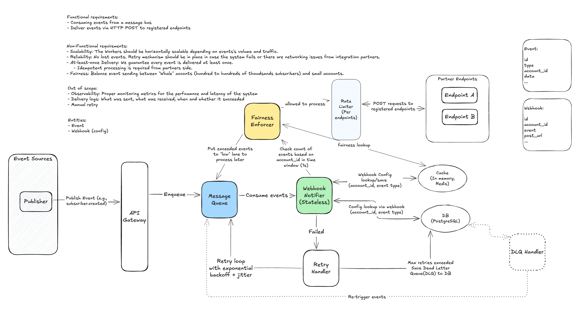
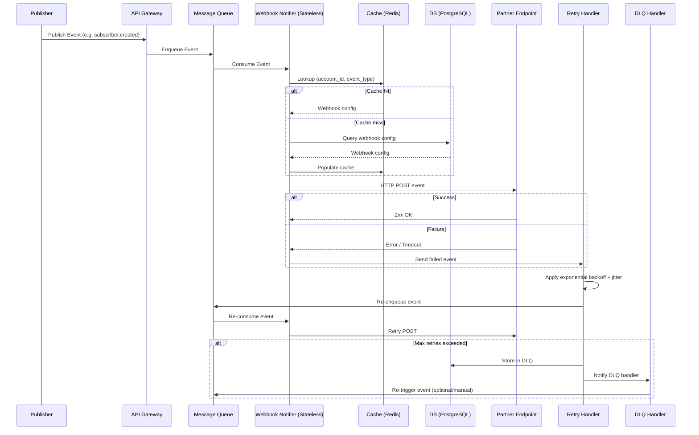

# Webhook Notifier's System Design
## Functional Requirements
- Consuming events from message bus
- Deliver events via HTTP POST to registered endpoints
- Retry logic: Retry with increasing delays, up to 72 hours (in case deploys, outages, misconfigurations)
## Non-Functional Requirements 
- Scalability: The Workers should be horizontally scalable depending on events's volume and traffic.
- Reliability: No lost events. Retry mechanism should be in place in case the system fails or there are networking issues from integration partners.
- At-least-once Delivery: We guarantee every event is delivered at least once.
    - Idempotent processing is required from partners side.
- Fairness: Balance event sending between "Whale" acconts (hundred to hundreds of thoudsands subscribers) and small accounts.

## Out of scope
- Observability: Proper monitoring metrics for the perfoamnce and latency of the system
- Delivery logs: What was sent, what was received, when and whether it succeeded
- Manual retry

## Core Entities
### Webhook
A registered destination URL for a specific account

- id
- account_id
- event
- post_url
...

### Event
An immutable fact that something happened

- id
- type
- account_id
- data
...

### Others (Out of scope)
- EventAttempt: Log of one individual HTTP call including requested url, header, body, response, status code, latency, etc (id, event_id, attempt_number, request_url, ...)

## API Design
### Webhook payload
This is what we send to the partners. The most important "API" in the entire system

```
POST <registed_url>
Headers:
...
BODY:
{
    id: string
    event_type: string
    account_id: string
    data: object
    timestamp: long
    ...
}
```

Success criteria for delivery:
- HTTP 2xx response within 10 seconds

Failed criteria for delivery:
- HTTP 5xx
- Timeout > 20s
- Others

## High-Level Architecture
### Full picture


View full picture [here](https://excalidraw.com/#json=KPbpLea9pCKX9iUaqZkML,2r1c7OddPQRsVGgmr8oY9Q)

### High-level flow



### Publisher
Simulates internal systems by genering self-contained JSON events and pushing them to the **message queue**. 
Using a message broker sucessfully decouples the event generation from the webhook delivery, allowing the system to buffer massve bursts of traffic.

### Message Queue

Responsibilities:
- Buffer events
- Decouple producers from consumers
- High throughput
- partitioning enables fairness + scalability
- Replicated and highly available
- Replay capabilities

-> Choose Kafka to sastifies these criterias, in additional Kafka provides:
- Built-in replay capacity
- High throughputs (millions/sec)
- Built-in Partitioning and Replication
- Order preserved within partition
- High durable and reliable: Messages are save on disk, replicated across brokers -> Ensure outages don't lead to data loss, replicas can be promoted to leaders if the leader fails(down).

Trade offs:
- Requires partition strategy design
- Adds complexity to the system
- Adds latency

### Partitioning Strategy
Requirements:
- Strong fairness baseline
- Partial orderding per account

Trade offs and considerations:
- Hot partitions for large accounts
- We cannot "move" existing messages cheaply
- Rebalancing is mostly about the future events
- Requires rebalancing strategy


Therefore, we should never rely on partitioning alone to achieve fairness. We need additional mechanisms to ensure fairness.
- Start simple with base strategy `hash(account_id)`
- Enforce fairness at dispatcher layer
- Add endpoint-level rate limiting
- Circut breakker if needed
- Retry isolation
Its correctness depends entirely on how we implement control plane around Kafka, not Kafka itself.

### Webhook Notifier
The **Webhook Notifier Workers** continuously poll the message bus for new events. Because these workers are completely stateless, you can easily implement horizontal scaling by spinning up multiple instances of the worker to distribute the load. 

Responsibilities:
- Consume events from message bus
- Resolve webhook config
- Dispatch HTTP requests
- Handle retries
- Need to be Statless to able to scale horizontally via consumer group


### Database
- Fast lookup by (account_id, event_type)
- Robust
- Strong Consistentcy for updates
- Transactional

-> PostgreSQL can satisfy these requirements, but it can be a bottleneck for high-volume systems. 
- Read replicas
- Strong consistency
- Mature ecosystem
- Suitable for relational config

### Cache
Our cache need to be stateless, fast and highly available to reduce DB load
- Fast and able to share state between our worker (notifier consumer)
- Able to store short-lived data (TTL)
- Low latency

There are several options
- Redis: Low latency, TTL support, ideal for short-lived claims
- Postgres: Durable and auditable, better for long-term records and complex queries
- S3/Blob: High latency, used for mapping large payloads or archival references

Use Redis for quick dedup checks and a DB for audit trails if needed

Trade offs:
- Need to handle cache invalidation
    - Since our business requirents accepts stale data on short period of time, we can use short TTL to handle cache invalidation
- Redis failure -> DB overload risk.
    - We can use circuit breaker pattern to handle this

### Retry Handler

- Expotential backoff + jitter
- Jitter
- Bounded retries

Since we're already using Kafka for our Message Queue, we can use Kafka's built-in retry mechanism to handle retries by using Kafka retry topics (tiered delays)
- Scalable with partitioning and replication
- No need to maintain separate retry infrastructure
- Transparent retry stages
- Avoids centralized retry service

> main-topic -> retry-1m -> retry-5m -> retry-30m -> DLQ

retry topics:
- retry-1m
- retry-5m
- retry-25m

jitter:
- 0–50% of delay

max retries:
- 4

Trade offs:
- Might flooded queue in case of massive failures
- More topics to manage
- Slightly more complex routing

### Endpoint-level rate limiting
We need to rate limit per endpoint to prevent overwhelming partners with too many requests at once as well as fairness between accounts and retry storms.

-> Redis token bucket

### Circut Breaker

As our current implementation, we might need to add a Circuit breaker to prevent retry storms, detect failing endpoints and stop sending events to them for a while.
- Act as a rate limiter between Webhook Notifier and Partner Endpoint
- Track per-endpoints: error rate, latency
- Take advantages of in-memory and Redis shared state
- Endpoints down detection

-> Use Redis for tracking and in-memory for fast access and avoiding inconsistent state between workers.

Trade offs:
- Requires tunning threshholds


### Dead Letter Queue (DLQ)
We need to store permanently failed events
- Events need to be store for querying/debugging/re-processing in case manual retry
- Tracing and monitoring

-> Choose store DLQ at Database(PostgreSQL) instead of Kafka:

Strategy:
- Put DLQ into DB in case
    - Max retries exceed
    - Payload data is invalid to avoid polluting Kafka topics
    - Endpoints down via circuit breaker 

Trade offs:
- Might polluted Database on spike of failures
- Need to handle DB failure

### Observability & monitoring
Metrics:
- Queue lag -> Throttle producers as Kafka happily accepts infinite events
- Delivery latency
- Worker processing latency and succes/failure rate
- Retry rate
- Acknowledgement latency (Kafka)
- DLQ size and age
- Per-endpoint success rates and latency percentiles
- Queue depth metrics

Tech stack: Prometheus + Grafana
-> Easy to setup and widely used in the industry. Has built-in API and integration

Alerts:
- Spikes in HTTP response status code 4xx/5xx
- DLQ growth
- Increased processing lag.

Furthers:
Log structured events (event ID, account ID, attempts) and add traces for workflows spanning services.

## Testing and operational scripts
- Simulate retires, network errors, and signature failures in staging
- Provide a replay CLI/UI that re-validates signature, rate-limits replays and requires manual approval
